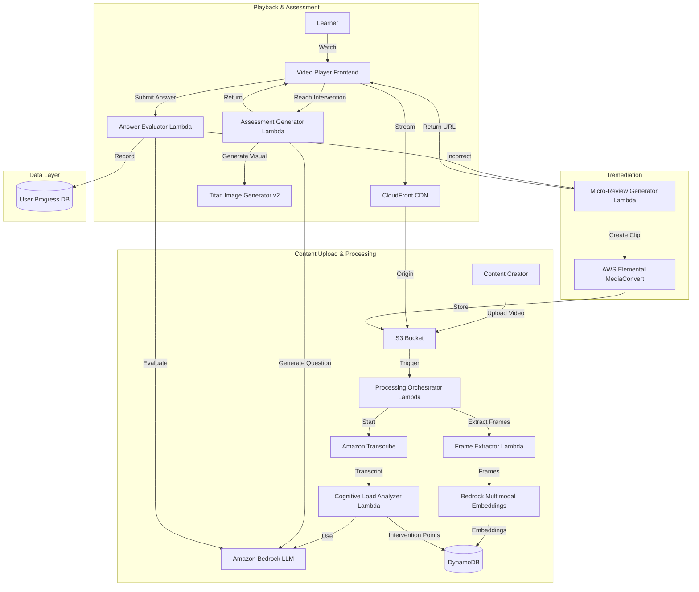

# Design Document: Active Recall Engine

## Overview

The Active Recall Engine is a cloud-native video learning platform built on AWS services that transforms passive video consumption into active learning through intelligent intervention points and multimodal assessments. The system processes educational videos through a multimodal ingestion pipeline, analyzes cognitive load to identify optimal intervention moments, and generates contextually relevant assessments including AI-generated visual diagrams for spatial concepts.

The architecture follows a serverless, event-driven design using AWS Lambda, Amazon S3, Amazon Bedrock, Amazon Titan Image Generator v2, Amazon Transcribe, and AWS Elemental MediaConvert. The system maintains separation between content processing (asynchronous), real-time playback (synchronous), and assessment generation (on-demand).

## Architecture

### High-Level Architecture



### Component Interaction Flow

1. **Video Upload Flow**: Content creator uploads video → S3 event triggers Processing Orchestrator → Parallel processing of transcription and frame extraction → Cognitive load analysis → Store metadata
2. **Playback Flow**: Learner requests video → CloudFront serves video → Frontend tracks playback position → At intervention point, pause and request assessment
3. **Assessment Flow**: Frontend requests assessment → Assessment Generator uses Bedrock for question + Titan for visuals → Return multimodal assessment → User responds → Evaluator validates
4. **Remediation Flow**: Incorrect answer → Identify answer timestamp → MediaConvert creates slowed clip → Return clip URL → Play before resuming

## Frontend Architecture

### Technology Stack

- **Framework**: React 18 with TypeScript
- **State Management**: Redux Toolkit for global state, React Query for server state
- **Video Player**: Video.js with custom plugins
- **Drawing Canvas**: Fabric.js for interactive drawing tools
- **Styling**: Tailwind CSS with custom components
- **Build Tool**: Vite
- **Testing**: Vitest + React Testing Library + fast-check (property-based testing)

### Frontend Directory Structure

```
frontend/
├── src/
│   ├── components/
│   │   ├── video/
│   │   │   ├── VideoPlayer.tsx           # Main video player component
│   │   │   ├── VideoControls.tsx         # Custom playback controls
│   │   │   ├── InterventionMarker.tsx    # Timeline markers for interventions
│   │   │   └── ProgressTracker.tsx       # Visual progress indicator
│   │   ├── assessment/
│   │   │   ├── AssessmentOverlay.tsx     # Modal overlay for assessments
│   │   │   ├── TextAssessment.tsx        # Text-based question component
│   │   │   ├── VisualAssessment.tsx      # Visual diagram assessment
│   │   │   ├── DrawingCanvas.tsx         # Interactive drawing interface
│   │   │   └── FeedbackDisplay.tsx       # Evaluation feedback component
│   │   ├── upload/
│   │   │   ├── VideoUploader.tsx         # Drag-and-drop upload interface
│   │   │   ├── UploadProgress.tsx        # Upload progress indicator
│   │   │   └── ProcessingStatus.tsx      # Video processing status
│   │   ├── dashboard/
│   │   │   ├── LearnerDashboard.tsx      # Learner progress view
│   │   │   ├── CreatorDashboard.tsx      # Creator analytics view
│   │   │   ├── VideoCard.tsx             # Video thumbnail card
│   │   │   └── AnalyticsChart.tsx        # Comprehension score charts
│   │   ├── auth/
│   │   │   ├── LoginForm.tsx             # Authentication form
│   │   │   ├── RegisterForm.tsx          # User registration
│   │   │   └── ProtectedRoute.tsx        # Route guard component
│   │   └── common/
│   │       ├── Button.tsx                # Reusable button component
│   │       ├── Input.tsx                 # Form input component
│   │       ├── Modal.tsx                 # Modal dialog component
│   │       └── Spinner.tsx               # Loading indicator
│   ├── hooks/
│   │   ├── useVideoPlayer.ts             # Video player state management
│   │   ├── useInterventions.ts           # Intervention point handling
│   │   ├── useAssessment.ts              # Assessment submission logic
│   │   ├── useAuth.ts                    # Authentication state
│   │   └── useProgress.ts                # Progress tracking
│   ├── store/
│   │   ├── index.ts                      # Redux store configuration
│   │   ├── slices/
│   │   │   ├── videoSlice.ts             # Video playback state
│   │   │   ├── assessmentSlice.ts        # Assessment state
│   │   │   ├── authSlice.ts              # Authentication state
│   │   │   └── progressSlice.ts          # User progress state
│   │   └── api/
│   │       ├── videoApi.ts               # Video API endpoints (React Query)
│   │       ├── assessmentApi.ts          # Assessment API endpoints
│   │       └── analyticsApi.ts           # Analytics API endpoints
│   ├── services/
│   │   ├── api.ts                        # Base API client (Axios)
│   │   ├── videoService.ts               # Video-related API calls
│   │   ├── assessmentService.ts          # Assessment API calls
│   │   ├── authService.ts                # Authentication API calls
│   │   └── storageService.ts             # Local storage utilities
│   ├── types/
│   │   ├── video.ts                      # Video-related types
│   │   ├── assessment.ts                 # Assessment types
│   │   ├── user.ts                       # User and auth types
│   │   └── analytics.ts                  # Analytics types
│   ├── utils/
│   │   ├── timeFormat.ts                 # Time formatting utilities
│   │   ├── validation.ts                 # Input validation
│   │   └── drawing.ts                    # Drawing canvas utilities
│   ├── pages/
│   │   ├── HomePage.tsx                  # Landing page
│   │   ├── VideoPlayerPage.tsx           # Video playback page
│   │   ├── UploadPage.tsx                # Video upload page
│   │   ├── DashboardPage.tsx             # User dashboard
│   │   ├── AnalyticsPage.tsx             # Creator analytics
│   │   └── LoginPage.tsx                 # Authentication page
│   ├── App.tsx                           # Root application component
│   ├── main.tsx                          # Application entry point
│   └── routes.tsx                        # Route configuration
├── public/
│   └── assets/                           # Static assets
├── tests/
│   ├── unit/                             # Unit tests
│   ├── integration/                      # Integration tests
│   └── properties/                       # Property-based tests
├── package.json
├── tsconfig.json
├── vite.config.ts
└── tailwind.config.js
```

### Key Frontend Components

**VideoPlayer Component**:
- Manages video.js player instance
- Tracks playback position and syncs with backend
- Detects intervention points and triggers assessments
- Handles fullscreen mode and volume persistence
- Implements offline caching for position recovery

**AssessmentOverlay Component**:
- Displays modal overlay when intervention point is reached
- Renders appropriate assessment type (text or visual)
- Manages user input and submission
- Shows feedback and micro-review clips
- Prevents video resumption until assessment is completed

**DrawingCanvas Component**:
- Provides drawing tools (pen, arrow, circle, line)
- Renders background image from Titan
- Captures drawing data for evaluation
- Supports undo/redo functionality
- Exports drawing as structured data

**State Management Flow**:
```typescript
// Video playback state
videoSlice: {
  currentVideo: Video | null,
  playbackPosition: number,
  isPlaying: boolean,
  volume: number,
  interventionPoints: InterventionPoint[],
  currentInterventionIndex: number
}

// Assessment state
assessmentSlice: {
  currentAssessment: Assessment | null,
  isDisplayed: boolean,
  userResponse: string | DrawingData,
  evaluationResult: EvaluationResult | null,
  microReviewUrl: string | null
}

// Progress state
progressSlice: {
  completedVideos: string[],
  assessmentHistory: AssessmentAttempt[],
  comprehensionScores: Record<string, number>
}
```

## Backend Architecture

### Technology Stack

- **Compute**: AWS Lambda (Python 3.11)
- **API Gateway**: AWS API Gateway (REST API)
- **Storage**: Amazon S3 (videos, clips, images)
- **Database**: Amazon DynamoDB (metadata, progress, analytics)
- **AI Services**: Amazon Bedrock, Amazon Titan, Amazon Transcribe
- **Video Processing**: AWS Elemental MediaConvert, FFmpeg (in Lambda)
- **CDN**: Amazon CloudFront
- **Authentication**: AWS Cognito
- **Monitoring**: AWS CloudWatch, AWS X-Ray
- **IaC**: AWS CDK (TypeScript)

### Backend Directory Structure

```
backend/
├── lambdas/
│   ├── processing/
│   │   ├── orchestrator/
│   │   │   ├── handler.py                # Processing orchestrator entry point
│   │   │   ├── transcription.py          # Transcribe integration
│   │   │   ├── frame_extraction.py       # Frame extraction logic
│   │   │   └── requirements.txt
│   │   ├── frame_extractor/
│   │   │   ├── handler.py                # Frame extraction Lambda
│   │   │   ├── ffmpeg_wrapper.py         # FFmpeg utilities
│   │   │   ├── bedrock_embeddings.py     # Multimodal embedding generation
│   │   │   └── requirements.txt
│   │   └── cognitive_analyzer/
│   │       ├── handler.py                # Cognitive load analysis
│   │       ├── bedrock_client.py         # Bedrock LLM client
│   │       ├── load_analysis.py          # Cognitive load algorithms
│   │       └── requirements.txt
│   ├── playback/
│   │   ├── assessment_generator/
│   │   │   ├── handler.py                # Assessment generation entry point
│   │   │   ├── question_generator.py     # Text question generation
│   │   │   ├── visual_generator.py       # Titan image generation
│   │   │   ├── concept_classifier.py     # Spatial vs non-spatial classification
│   │   │   └── requirements.txt
│   │   ├── answer_evaluator/
│   │   │   ├── handler.py                # Answer evaluation entry point
│   │   │   ├── text_evaluator.py         # Semantic similarity evaluation
│   │   │   ├── visual_evaluator.py       # Drawing validation
│   │   │   ├── feedback_generator.py     # Feedback message generation
│   │   │   └── requirements.txt
│   │   └── micro_review_generator/
│   │       ├── handler.py                # Micro-review generation
│   │       ├── mediaconvert_client.py    # MediaConvert integration
│   │       ├── transcript_search.py      # Answer location in transcript
│   │       └── requirements.txt
│   ├── api/
│   │   ├── video/
│   │   │   ├── get_video.py              # Get video metadata
│   │   │   ├── list_videos.py            # List user videos
│   │   │   ├── upload_video.py           # Generate upload presigned URL
│   │   │   └── requirements.txt
│   │   ├── assessment/
│   │   │   ├── get_assessment.py         # Fetch assessment by ID
│   │   │   ├── submit_response.py        # Submit user response
│   │   │   └── requirements.txt
│   │   ├── progress/
│   │   │   ├── get_progress.py           # Get user progress
│   │   │   ├── update_position.py        # Update playback position
│   │   │   └── requirements.txt
│   │   └── analytics/
│   │       ├── learner_analytics.py      # Learner dashboard data
│   │       ├── creator_analytics.py      # Creator analytics data
│   │       └── requirements.txt
│   └── auth/
│       ├── register.py                   # User registration
│       ├── login.py                      # User login
│       └── requirements.txt
├── shared/
│   ├── models/
│   │   ├── video.py                      # Video data models
│   │   ├── assessment.py                 # Assessment data models
│   │   ├── user.py                       # User data models
│   │   └── progress.py                   # Progress data models
│   ├── database/
│   │   ├── dynamodb_client.py            # DynamoDB wrapper
│   │   ├── video_repository.py           # Video data access
│   │   ├── assessment_repository.py      # Assessment data access
│   │   ├── user_repository.py            # User data access
│   │   └── progress_repository.py        # Progress data access
│   ├── aws/
│   │   ├── s3_client.py                  # S3 utilities
│   │   ├── bedrock_client.py             # Bedrock client
│   │   ├── transcribe_client.py          # Transcribe client
│   │   ├── mediaconvert_client.py        # MediaConvert client
│   │   └── cognito_client.py             # Cognito authentication
│   ├── utils/
│   │   ├── error_handler.py              # Error handling utilities
│   │   ├── circuit_breaker.py            # Circuit breaker implementation
│   │   ├── retry.py                      # Retry logic
│   │   └── logger.py                     # Structured logging
│   └── constants.py                      # Shared constants
├── infrastructure/
│   ├── lib/
│   │   ├── active-recall-stack.ts        # Main CDK stack
│   │   ├── storage-stack.ts              # S3 and DynamoDB resources
│   │   ├── compute-stack.ts              # Lambda functions
│   │   ├── api-stack.ts                  # API Gateway configuration
│   │   ├── ai-stack.ts                   # Bedrock and Titan setup
│   │   ├── video-stack.ts                # MediaConvert and Transcribe
│   │   ├── cdn-stack.ts                  # CloudFront distribution
│   │   └── monitoring-stack.ts           # CloudWatch and X-Ray
│   ├── bin/
│   │   └── app.ts                        # CDK app entry point
│   ├── cdk.json
│   ├── package.json
│   └── tsconfig.json
├── tests/
│   ├── unit/                             # Unit tests
│   ├── integration/                      # Integration tests
│   ├── properties/                       # Property-based tests (Hypothesis)
│   └── fixtures/                         # Test data and mocks
├── scripts/
│   ├── deploy.sh                         # Deployment script
│   ├── seed_data.py                      # Database seeding
│   └── generate_test_videos.py           # Test video generation
└── requirements.txt                      # Shared Python dependencies
```

### API Endpoints

**Video Management**:
- `POST /api/videos/upload` - Generate presigned URL for video upload
- `GET /api/videos/{videoId}` - Get video metadata and intervention points
- `GET /api/videos` - List videos (filtered by user role)
- `GET /api/videos/{videoId}/status` - Get processing status

**Assessment**:
- `GET /api/assessments/{assessmentId}` - Fetch assessment for intervention point
- `POST /api/assessments/{assessmentId}/submit` - Submit user response
- `GET /api/assessments/{assessmentId}/micro-review` - Get micro-review clip URL

**Progress Tracking**:
- `GET /api/progress/{userId}/{videoId}` - Get user progress for video
- `PUT /api/progress/{userId}/{videoId}/position` - Update playback position
- `POST /api/progress/{userId}/{videoId}/complete` - Mark video as completed

**Analytics**:
- `GET /api/analytics/learner/{userId}` - Get learner dashboard data
- `GET /api/analytics/creator/{userId}` - Get creator analytics
- `GET /api/analytics/video/{videoId}` - Get video-specific analytics

**Authentication**:
- `POST /api/auth/register` - User registration
- `POST /api/auth/login` - User login
- `POST /api/auth/logout` - User logout
- `GET /api/auth/me` - Get current user info

### Lambda Layer Structure

```
layers/
├── common/
│   └── python/
│       └── lib/
│           └── python3.11/
│               └── site-packages/
│                   ├── boto3/
│                   ├── requests/
│                   └── shared/          # Shared code from backend/shared
├── ffmpeg/
│   └── bin/
│       └── ffmpeg                       # FFmpeg binary for frame extraction
└── ai/
    └── python/
        └── lib/
            └── python3.11/
                └── site-packages/
                    ├── anthropic/
                    └── langchain/
```

### Database Schema (DynamoDB)

**Videos Table**:
- Partition Key: `video_id` (String)
- GSI: `creator_id-upload_timestamp-index` for creator queries
- Attributes: title, s3_uri, duration, processing_status, transcript, frames, intervention_points

**Assessments Table**:
- Partition Key: `assessment_id` (String)
- GSI: `video_id-timestamp-index` for video queries
- Attributes: video_id, type, question, image_url, expected_answer, concepts

**UserProgress Table**:
- Partition Key: `user_id` (String)
- Sort Key: `video_id` (String)
- Attributes: last_position, completed, comprehension_score, assessment_attempts

**Users Table**:
- Partition Key: `user_id` (String)
- GSI: `email-index` for login queries
- Attributes: email, password_hash, role, profile, created_at

**MicroReviews Table**:
- Partition Key: `clip_id` (String)
- GSI: `assessment_id-index` for assessment queries
- Attributes: video_id, s3_uri, duration, original_start_time, created_at

### Event-Driven Architecture

**S3 Event Notifications**:
```python
# Triggered on video upload
{
  "Records": [{
    "eventName": "ObjectCreated:Put",
    "s3": {
      "bucket": {"name": "active-recall-videos"},
      "object": {"key": "uploads/video123.mp4"}
    }
  }]
}
# Triggers: Processing Orchestrator Lambda
```

**EventBridge Rules**:
```python
# Transcription completion event
{
  "source": "aws.transcribe",
  "detail-type": "Transcribe Job State Change",
  "detail": {
    "TranscriptionJobStatus": "COMPLETED",
    "TranscriptionJobName": "video123-transcription"
  }
}
# Triggers: Cognitive Load Analyzer Lambda

# MediaConvert completion event
{
  "source": "aws.mediaconvert",
  "detail-type": "MediaConvert Job State Change",
  "detail": {
    "status": "COMPLETE",
    "jobId": "clip456-job"
  }
}
# Triggers: Micro-Review URL update in DynamoDB
```

### Infrastructure as Code (CDK)

**Example Stack Definition**:
```typescript
// infrastructure/lib/compute-stack.ts
import * as cdk from 'aws-cdk-lib';
import * as lambda from 'aws-cdk-lib/aws-lambda';
import * as s3 from 'aws-cdk-lib/aws-s3';

export class ComputeStack extends cdk.Stack {
  constructor(scope: cdk.App, id: string, props?: cdk.StackProps) {
    super(scope, id, props);

    // Common Lambda layer
    const commonLayer = new lambda.LayerVersion(this, 'CommonLayer', {
      code: lambda.Code.fromAsset('layers/common'),
      compatibleRuntimes: [lambda.Runtime.PYTHON_3_11],
    });

    // Processing Orchestrator Lambda
    const orchestrator = new lambda.Function(this, 'ProcessingOrchestrator', {
      runtime: lambda.Runtime.PYTHON_3_11,
      handler: 'handler.lambda_handler',
      code: lambda.Code.fromAsset('lambdas/processing/orchestrator'),
      layers: [commonLayer],
      timeout: cdk.Duration.minutes(5),
      memorySize: 512,
      environment: {
        VIDEO_METADATA_TABLE: 'VideoMetadata',
        TRANSCRIBE_ROLE_ARN: 'arn:aws:iam::...',
      },
    });

    // Grant S3 read permissions
    const videoBucket = s3.Bucket.fromBucketName(this, 'VideoBucket', 'active-recall-videos');
    videoBucket.grantRead(orchestrator);

    // Add S3 event notification
    videoBucket.addEventNotification(
      s3.EventType.OBJECT_CREATED,
      new s3n.LambdaDestination(orchestrator),
      { prefix: 'uploads/' }
    );
  }
}
```

## Components and Interfaces

### 1. Processing Orchestrator Lambda

**Responsibility**: Coordinates the multimodal ingestion pipeline for uploaded videos.

**Inputs**:
- S3 event notification containing video key and bucket name

**Outputs**:
- Transcription job ID (Amazon Transcribe)
- Frame extraction job status
- Processing completion event

**Interface**:
```python
def handler(event, context):
    """
    Orchestrates video processing pipeline.
    
    Args:
        event: S3 event notification
        context: Lambda context
        
    Returns:
        dict: Processing job status and IDs
    """
    video_key = event['Records'][0]['s3']['object']['key']
    bucket = event['Records'][0]['s3']['bucket']['name']
    
    # Start transcription
    transcription_job_id = start_transcription(bucket, video_key)
    
    # Start frame extraction
    frame_job_id = start_frame_extraction(bucket, video_key)
    
    # Store processing metadata
    store_processing_job(video_key, transcription_job_id, frame_job_id)
    
    return {
        'video_key': video_key,
        'transcription_job_id': transcription_job_id,
        'frame_job_id': frame_job_id,
        'status': 'processing'
    }
```

### 2. Frame Extractor Lambda

**Responsibility**: Extracts video frames at 1-second intervals and processes them through Bedrock Multimodal Embeddings.

**Inputs**:
- S3 video location
- Extraction interval (default: 1 second)

**Outputs**:
- Frame embeddings stored in DynamoDB
- Visual transition points (slide changes)

**Interface**:
```python
def extract_and_embed_frames(video_s3_uri, interval_seconds=1):
    """
    Extracts frames and generates multimodal embeddings.
    
    Args:
        video_s3_uri: S3 URI of video file
        interval_seconds: Frame extraction interval
        
    Returns:
        list: Frame metadata with embeddings and timestamps
    """
    frames = extract_frames_ffmpeg(video_s3_uri, interval_seconds)
    
    frame_data = []
    for timestamp, frame_image in frames:
        # Generate embedding using Bedrock
        embedding = bedrock_multimodal_embed(frame_image)
        
        # Detect slide changes using embedding similarity
        is_transition = detect_visual_transition(embedding, frame_data)
        
        frame_data.append({
            'timestamp': timestamp,
            'embedding': embedding,
            'is_transition': is_transition
        })
    
    return frame_data
```

**Slide Change Detection Algorithm**:
- Compare cosine similarity between consecutive frame embeddings
- If similarity < 0.7, mark as visual transition
- Store transition timestamps for correlation with transcript

### 3. Cognitive Load Analyzer Lambda

**Responsibility**: Analyzes transcripts using Cognitive Load Theory to identify High Element Interactivity segments and mark intervention points.

**Inputs**:
- Time-stamped transcript from Amazon Transcribe
- Video metadata (duration, frame transitions)

**Outputs**:
- List of intervention points with timestamps
- Cognitive load scores for each segment

**Interface**:
```python
def analyze_cognitive_load(transcript, video_metadata):
    """
    Identifies high cognitive load segments using Bedrock LLM.
    
    Args:
        transcript: Time-stamped transcript data
        video_metadata: Video duration and frame transitions
        
    Returns:
        list: Intervention points with timestamps and context
    """
    # Segment transcript into 60-second windows
    segments = create_time_windows(transcript, window_size=60)
    
    intervention_points = []
    
    for segment in segments:
        # Analyze with Bedrock using cognitive load prompt
        analysis = bedrock_analyze_segment(segment)
        
        if analysis['cognitive_load'] == 'high':
            intervention_points.append({
                'timestamp': segment['end_time'],
                'concepts': analysis['new_concepts'],
                'context': segment['text'],
                'load_score': analysis['score']
            })
    
    # Ensure minimum intervention frequency (1 per 5 minutes)
    intervention_points = ensure_minimum_frequency(
        intervention_points, 
        video_metadata['duration'],
        min_interval=300
    )
    
    return intervention_points
```

**Cognitive Load Analysis Prompt Template**:
```
Analyze the following 60-second transcript segment from an educational video.

Transcript:
{segment_text}

Tasks:
1. Identify all new concepts introduced in this segment
2. Determine if multiple concepts are introduced simultaneously (high element interactivity)
3. Assess cognitive load as: low, medium, or high
4. If high, explain which concepts create interactivity

Respond in JSON format:
{
  "new_concepts": ["concept1", "concept2", ...],
  "cognitive_load": "low|medium|high",
  "score": 0-10,
  "reasoning": "explanation"
}
```

### 4. Assessment Generator Lambda

**Responsibility**: Generates contextually relevant assessments at intervention points, including text questions and AI-generated visual diagrams.

**Inputs**:
- Intervention point data (timestamp, concepts, context)
- Video transcript segment
- Frame embeddings near intervention point

**Outputs**:
- Assessment object containing question, type, and visual assets
- Expected answer for evaluation

**Interface**:
```python
def generate_assessment(intervention_point, transcript_context, frame_data):
    """
    Generates multimodal assessment for intervention point.
    
    Args:
        intervention_point: Intervention metadata
        transcript_context: Surrounding transcript text
        frame_data: Frame embeddings and images
        
    Returns:
        dict: Assessment with question, visuals, and expected answer
    """
    # Determine if concepts are spatial
    is_spatial = classify_concept_type(intervention_point['concepts'])
    
    if is_spatial:
        # Generate visual assessment with Titan
        assessment = generate_visual_assessment(
            intervention_point,
            transcript_context,
            frame_data
        )
    else:
        # Generate text-based assessment with Bedrock
        assessment = generate_text_assessment(
            intervention_point,
            transcript_context
        )
    
    return assessment

def generate_visual_assessment(intervention_point, context, frame_data):
    """
    Creates visual fill-in-the-blank assessment using Titan Image Generator.
    
    Args:
        intervention_point: Intervention metadata
        context: Transcript context
        frame_data: Video frames near intervention
        
    Returns:
        dict: Visual assessment with incomplete diagram
    """
    # Create prompt for Titan based on concept type
    concept = intervention_point['concepts'][0]
    
    if 'linked list' in concept.lower():
        prompt = create_linked_list_prompt(context)
        conditioning_type = 'canny_edge'
    elif 'tree' in concept.lower():
        prompt = create_tree_prompt(context)
        conditioning_type = 'segmentation'
    elif 'graph' in concept.lower():
        prompt = create_graph_prompt(context)
        conditioning_type = 'canny_edge'
    elif 'memory' in concept.lower() or 'pointer' in concept.lower():
        prompt = create_memory_diagram_prompt(context)
        conditioning_type = 'segmentation'
    else:
        prompt = create_generic_diagram_prompt(concept, context)
        conditioning_type = 'canny_edge'
    
    # Generate image with Titan
    image_url = titan_generate_image(
        prompt=prompt,
        conditioning_type=conditioning_type,
        negative_prompt="complete diagram, filled in, no blanks"
    )
    
    # Determine what element is missing
    missing_element = extract_missing_element(prompt, concept)
    
    return {
        'type': 'visual',
        'question': f"Complete the diagram by adding the missing {missing_element}",
        'image_url': image_url,
        'expected_answer': missing_element,
        'concept': concept
    }
```

**Titan Image Generation Prompts**:

For Linked Lists:
```
"Technical diagram of a singly linked list with 4 nodes. Each node shows [data|next] structure. 
Nodes are connected by arrows. The arrow between node 2 and node 3 is missing. 
Clean, educational style with labels. White background."
```

For Binary Trees:
```
"Technical diagram of a binary tree with root node containing value X. 
Left and right child nodes are shown but one child pointer is missing. 
Clean educational style with node circles and connecting lines. White background."
```

For Memory Layouts:
```
"Technical diagram showing memory layout with stack and heap. 
Pointer arrows from stack variables to heap objects. 
One pointer arrow is incomplete/missing. Clean educational style. White background."
```

### 5. Answer Evaluator Lambda

**Responsibility**: Evaluates user responses using semantic similarity for text and structural matching for visual responses.

**Inputs**:
- User response (text or drawing data)
- Expected answer
- Assessment type

**Outputs**:
- Evaluation result (correct/incorrect)
- Feedback message
- Trigger for micro-review if incorrect

**Interface**:
```python
def evaluate_response(user_response, expected_answer, assessment_type):
    """
    Evaluates user response using Bedrock for semantic matching.
    
    Args:
        user_response: User's submitted answer
        expected_answer: Correct answer
        assessment_type: 'text' or 'visual'
        
    Returns:
        dict: Evaluation result with feedback
    """
    if assessment_type == 'text':
        is_correct = evaluate_text_response(user_response, expected_answer)
    else:
        is_correct = evaluate_visual_response(user_response, expected_answer)
    
    feedback = generate_feedback(is_correct, expected_answer)
    
    return {
        'correct': is_correct,
        'feedback': feedback,
        'expected_answer': expected_answer if not is_correct else None
    }

def evaluate_text_response(user_response, expected_answer):
    """
    Uses Bedrock to evaluate semantic similarity.
    
    Args:
        user_response: User's text answer
        expected_answer: Expected text answer
        
    Returns:
        bool: True if semantically similar
    """
    prompt = f"""
    Evaluate if the student's answer is semantically equivalent to the expected answer.
    
    Expected Answer: {expected_answer}
    Student Answer: {user_response}
    
    Consider the answer correct if:
    - The core concept is correctly identified
    - Minor wording differences are acceptable
    - Technical terminology is used correctly
    
    Respond with JSON:
    {{
      "correct": true/false,
      "reasoning": "explanation"
    }}
    """
    
    result = bedrock_invoke(prompt)
    return result['correct']

def evaluate_visual_response(user_drawing, expected_element):
    """
    Evaluates visual response by checking if missing element was added.
    
    Args:
        user_drawing: Drawing data from frontend
        expected_element: What should have been drawn
        
    Returns:
        bool: True if element was correctly added
    """
    # For MVP, check if user drew in the correct region
    # Future: Use computer vision to validate drawing
    
    if expected_element == 'arrow' or expected_element == 'pointer':
        return validate_arrow_drawn(user_drawing)
    elif expected_element == 'node':
        return validate_node_drawn(user_drawing)
    else:
        return validate_generic_element(user_drawing, expected_element)
```

### 6. Micro-Review Generator Lambda

**Responsibility**: Creates custom 30-second review clips from the original video, slowed to 80% speed, containing the answer to the question.

**Inputs**:
- Video S3 URI
- Intervention point timestamp
- Transcript with answer location

**Outputs**:
- S3 URI of generated micro-review clip
- Clip duration

**Interface**:
```python
def generate_micro_review(video_uri, intervention_point, transcript):
    """
    Creates a slowed-down review clip using MediaConvert.
    
    Args:
        video_uri: S3 URI of original video
        intervention_point: Intervention metadata
        transcript: Full transcript with timestamps
        
    Returns:
        dict: Micro-review clip URL and metadata
    """
    # Find where answer was explained in transcript
    answer_timestamp = find_answer_in_transcript(
        transcript,
        intervention_point['concepts'],
        intervention_point['timestamp']
    )
    
    # Calculate 30-second window around answer
    start_time = max(0, answer_timestamp - 15)
    end_time = start_time + 30
    
    # Create MediaConvert job
    job_id = mediaconvert_create_clip_job(
        input_uri=video_uri,
        start_time=start_time,
        end_time=end_time,
        speed_multiplier=0.8,  # 80% speed
        output_bucket='micro-reviews'
    )
    
    # Wait for job completion (async in production)
    clip_uri = wait_for_mediaconvert_job(job_id)
    
    return {
        'clip_uri': clip_uri,
        'duration': 37.5,  # 30 seconds at 80% speed
        'original_timestamp': answer_timestamp
    }

def find_answer_in_transcript(transcript, concepts, intervention_timestamp):
    """
    Locates where the answer was explained in the video.
    
    Args:
        transcript: Time-stamped transcript
        concepts: Concepts from intervention point
        intervention_timestamp: When intervention occurred
        
    Returns:
        float: Timestamp where answer is explained
    """
    # Search backward from intervention point
    search_window = transcript.get_window(
        start=intervention_timestamp - 120,
        end=intervention_timestamp
    )
    
    # Use Bedrock to find most relevant segment
    prompt = f"""
    Find the segment in this transcript where the following concepts are explained:
    Concepts: {', '.join(concepts)}
    
    Transcript:
    {search_window}
    
    Return the timestamp where the explanation is clearest.
    """
    
    result = bedrock_invoke(prompt)
    return result['timestamp']
```

### 7. Video Player Frontend

**Responsibility**: Manages video playback, intervention point handling, assessment display, and user interaction.

**Technology**: React with video.js for playback control

**Key Features**:
- Custom video player with intervention point markers
- Assessment overlay system
- Drawing canvas for visual assessments
- Progress tracking and analytics

**Interface**:
```typescript
interface VideoPlayerProps {
  videoId: string;
  interventionPoints: InterventionPoint[];
  onAssessmentComplete: (result: AssessmentResult) => void;
}

interface InterventionPoint {
  timestamp: number;
  assessmentId: string;
}

interface Assessment {
  type: 'text' | 'visual';
  question: string;
  imageUrl?: string;
  expectedAnswer: string;
}

class VideoPlayer extends React.Component<VideoPlayerProps> {
  private player: VideoJsPlayer;
  private currentInterventionIndex: number = 0;
  
  componentDidMount() {
    this.initializePlayer();
    this.setupInterventionHandlers();
  }
  
  setupInterventionHandlers() {
    this.player.on('timeupdate', () => {
      const currentTime = this.player.currentTime();
      const nextIntervention = this.props.interventionPoints[
        this.currentInterventionIndex
      ];
      
      if (nextIntervention && currentTime >= nextIntervention.timestamp) {
        this.handleIntervention(nextIntervention);
      }
    });
  }
  
  async handleIntervention(intervention: InterventionPoint) {
    // Pause video
    this.player.pause();
    
    // Fetch assessment
    const assessment = await fetchAssessment(intervention.assessmentId);
    
    // Show assessment overlay
    this.setState({
      showAssessment: true,
      currentAssessment: assessment
    });
  }
  
  async handleAssessmentSubmit(userResponse: string) {
    // Evaluate response
    const result = await evaluateResponse(
      this.state.currentAssessment.id,
      userResponse
    );
    
    if (result.correct) {
      // Resume playback
      this.setState({ showAssessment: false });
      this.player.play();
      this.currentInterventionIndex++;
    } else {
      // Show micro-review
      const microReview = await fetchMicroReview(
        this.state.currentAssessment.id
      );
      this.playMicroReview(microReview);
    }
    
    // Record result
    this.props.onAssessmentComplete(result);
  }
  
  playMicroReview(microReview: MicroReview) {
    // Switch to micro-review video source
    this.player.src(microReview.url);
    this.player.play();
    
    // When micro-review ends, return to main video
    this.player.one('ended', () => {
      this.player.src(this.props.videoUrl);
      this.player.currentTime(
        this.props.interventionPoints[this.currentInterventionIndex].timestamp
      );
      this.setState({ showAssessment: false });
      this.player.play();
      this.currentInterventionIndex++;
    });
  }
}
```

### 8. Drawing Canvas Component

**Responsibility**: Provides interactive drawing tools for visual assessments.

**Interface**:
```typescript
interface DrawingCanvasProps {
  backgroundImage: string;
  onSubmit: (drawingData: DrawingData) => void;
}

interface DrawingData {
  strokes: Stroke[];
  elements: DrawnElement[];
}

interface Stroke {
  points: Point[];
  color: string;
  width: number;
}

interface DrawnElement {
  type: 'arrow' | 'circle' | 'line' | 'text';
  position: Point;
  properties: any;
}

class DrawingCanvas extends React.Component<DrawingCanvasProps> {
  private canvas: HTMLCanvasElement;
  private ctx: CanvasRenderingContext2D;
  private currentTool: 'pen' | 'arrow' | 'circle' = 'pen';
  
  render() {
    return (
      <div className="drawing-canvas-container">
        
        <canvas ref={this.canvasRef} onMouseDown={this.handleMouseDown} />
        <div className="toolbar">
          <button onClick={() => this.setTool('pen')}>Pen</button>
          <button onClick={() => this.setTool('arrow')}>Arrow</button>
          <button onClick={() => this.setTool('circle')}>Circle</button>
          <button onClick={this.handleSubmit}>Submit</button>
        </div>
      </div>
    );
  }
  
  handleSubmit() {
    const drawingData = this.captureDrawingData();
    this.props.onSubmit(drawingData);
  }
}
```

## Data Models

### Video Metadata (DynamoDB)

```python
{
  'video_id': 'string',  # Partition key
  'title': 'string',
  'creator_id': 'string',
  's3_uri': 'string',
  'duration': 'number',  # seconds
  'upload_timestamp': 'number',
  'processing_status': 'string',  # 'processing', 'ready', 'failed'
  'transcript': {
    'job_id': 'string',
    's3_uri': 'string',
    'segments': [
      {
        'start_time': 'number',
        'end_time': 'number',
        'text': 'string'
      }
    ]
  },
  'frames': [
    {
      'timestamp': 'number',
      'embedding': 'list',  # 1536-dimensional vector
      'is_transition': 'boolean'
    }
  ],
  'intervention_points': [
    {
      'timestamp': 'number',
      'concepts': ['string'],
      'context': 'string',
      'load_score': 'number'
    }
  ]
}
```

### Assessment (DynamoDB)

```python
{
  'assessment_id': 'string',  # Partition key
  'video_id': 'string',  # GSI partition key
  'intervention_timestamp': 'number',
  'type': 'string',  # 'text' or 'visual'
  'question': 'string',
  'image_url': 'string',  # Optional, for visual assessments
  'expected_answer': 'string',
  'concepts': ['string'],
  'created_at': 'number'
}
```

### User Progress (DynamoDB)

```python
{
  'user_id': 'string',  # Partition key
  'video_id': 'string',  # Sort key
  'last_position': 'number',  # seconds
  'completed': 'boolean',
  'comprehension_score': 'number',  # 0-100
  'assessment_attempts': [
    {
      'assessment_id': 'string',
      'timestamp': 'number',
      'user_response': 'string',
      'correct': 'boolean',
      'time_spent': 'number'  # seconds
    }
  ],
  'intervention_points_completed': 'number',
  'intervention_points_total': 'number',
  'updated_at': 'number'
}
```

### User Account (DynamoDB)

```python
{
  'user_id': 'string',  # Partition key
  'email': 'string',  # GSI partition key
  'password_hash': 'string',
  'role': 'string',  # 'learner' or 'creator'
  'created_at': 'number',
  'profile': {
    'name': 'string',
    'preferences': {
      'auto_play_micro_reviews': 'boolean',
      'assessment_difficulty': 'string'
    }
  }
}
```

### Micro-Review Clip (DynamoDB)

```python
{
  'clip_id': 'string',  # Partition key
  'video_id': 'string',  # GSI partition key
  'assessment_id': 'string',
  's3_uri': 'string',
  'original_start_time': 'number',
  'original_end_time': 'number',
  'duration': 'number',
  'speed_multiplier': 'number',
  'created_at': 'number',
  'mediaconvert_job_id': 'string'
}
```

## Correctness Properties

*A property is a characteristic or behavior that should hold true across all valid executions of a system—essentially, a formal statement about what the system should do. Properties serve as the bridge between human-readable specifications and machine-verifiable correctness guarantees.*


### Property Reflection

After analyzing all acceptance criteria, I identified several areas of redundancy:

1. **Storage and Retrieval Properties**: Multiple criteria test that data is stored and can be retrieved (2.6, 3.5, 7.4, 10.5). These can be consolidated into properties about data persistence round-trips.

2. **UI Component Properties**: Several criteria test that UI elements exist and function (7.1, 7.2, 7.5, 13.1). These can be combined into properties about UI completeness.

3. **Playback State Properties**: Multiple criteria test playback state management (4.1, 4.2, 4.3, 4.4, 4.5). These can be consolidated into properties about state transitions.

4. **Assessment Generation Properties**: Criteria 5.1, 5.3, 5.6, and 6.5 all relate to assessment generation behavior and can be combined into comprehensive properties.

5. **Evaluation and Feedback Properties**: Criteria 8.4 and 8.5 both test system response to evaluation results and can be combined.

6. **Analytics Properties**: Multiple criteria (10.2, 10.3, 11.1, 11.2, 11.3, 11.4) test analytics calculations. These can be consolidated into properties about correct aggregation.

The following properties eliminate redundancy while maintaining comprehensive coverage:

### Core Properties

**Property 1: Video Upload and Storage Round-Trip**

*For any* valid video file in MP4, MOV, or AVI format under 5GB, uploading the video should result in it being stored in S3 with a unique identifier, and the video should be retrievable using that identifier.

**Validates: Requirements 1.1, 1.2, 1.3, 1.4**

**Property 2: File Size Validation**

*For any* video file exceeding 5GB, the upload should be rejected with an error message, and no S3 storage should occur.

**Validates: Requirements 1.5**

**Property 3: Multimodal Processing Completeness**

*For any* video stored in S3, the system should complete transcription, extract frames at 1-second intervals (duration in seconds = number of frames), generate embeddings for all frames, correlate visual transitions with transcript timestamps, and store all processed data retrievable by video ID.

**Validates: Requirements 2.1, 2.2, 2.3, 2.4, 2.5, 2.6**

**Property 4: Intervention Point Density**

*For any* video with duration D seconds, the cognitive load analyzer should identify at least floor(D / 300) intervention points, where each intervention point is associated with high-cognitive-load concepts from the transcript.

**Validates: Requirements 3.1, 3.3, 3.4, 3.5, 3.6**

**Property 5: Intervention Point Triggering**

*For any* video playback session, when playback time reaches an intervention point timestamp, the video should pause and an assessment should be displayed.

**Validates: Requirements 4.1, 4.2**

**Property 6: Assessment Completion Resumption**

*For any* displayed assessment, completing the assessment (either by submitting an answer or skipping) should resume video playback and mark the intervention point as processed.

**Validates: Requirements 4.3, 4.4**

**Property 7: Playback State Persistence**

*For any* authenticated user, closing and reopening a browser session should preserve the video playback position within 5 seconds of the last recorded position.

**Validates: Requirements 4.5**

**Property 8: Spatial Concept Visual Generation**

*For any* intervention point where the concepts include spatial terms (linked list, tree, graph, memory, pointer), the generated assessment should be of type 'visual' and include an image URL.

**Validates: Requirements 5.1, 5.3**

**Property 9: Non-Spatial Concept Text Generation**

*For any* intervention point where the concepts do not include spatial terms, the generated assessment should be of type 'text' and include a text question.

**Validates: Requirements 5.6**

**Property 10: Visual Assessment Structure**

*For any* visual assessment, the generated diagram should have exactly one missing or incomplete element that requires user completion.

**Validates: Requirements 5.5, 6.5**

**Property 11: Assessment UI Completeness**

*For any* text assessment, the UI should include a text input field and a submit button; for any visual assessment, the UI should include drawing tools and a submit button.

**Validates: Requirements 7.1, 7.2**

**Property 12: Empty Input Rejection**

*For any* assessment, attempting to submit an empty response should be prevented, and the submit button should remain disabled until valid input is provided.

**Validates: Requirements 7.3, 7.5**

**Property 13: Response Storage Round-Trip**

*For any* submitted assessment response, the response should be stored with its timestamp and assessment identifier, and should be retrievable using those identifiers.

**Validates: Requirements 7.4, 10.1, 10.5**

**Property 14: Semantic Similarity Evaluation**

*For any* text assessment with expected answer A, if a user submits response R that is semantically equivalent to A (even if textually different), the evaluation should return correct=true.

**Validates: Requirements 8.1, 8.2**

**Property 15: Correct Response Behavior**

*For any* assessment where the user provides a correct response, the system should display positive feedback and resume video playback without generating a micro-review clip.

**Validates: Requirements 8.4**

**Property 16: Incorrect Response Behavior**

*For any* assessment where the user provides an incorrect response, the system should display the correct answer, generate a micro-review clip, and play the clip before resuming the main video.

**Validates: Requirements 8.5, 9.1, 9.4**

**Property 17: Micro-Review Clip Properties**

*For any* generated micro-review clip, the clip should be exactly 30 seconds of original content, slowed to 80% speed (resulting in 37.5 seconds playback duration), and should contain the segment where the answer was explained.

**Validates: Requirements 9.2, 9.3**

**Property 18: Micro-Review Resumption**

*For any* micro-review clip playback, when the clip ends, the main video should resume from the intervention point timestamp where the incorrect answer was given.

**Validates: Requirements 9.5**

**Property 19: Comprehension Score Calculation**

*For any* user who completes a video with N intervention points and answers C correctly, the comprehension score should equal (C / N) * 100.

**Validates: Requirements 10.2**

**Property 20: User Analytics Accuracy**

*For any* user viewing their profile, the displayed assessment accuracy rate for a video should equal the number of correct responses divided by total responses for that video.

**Validates: Requirements 10.3**

**Property 21: Creator Analytics Aggregation**

*For any* video with multiple learner completions, the creator dashboard should display the median comprehension score, which should equal the median of all learners' comprehension scores for that video.

**Validates: Requirements 11.1, 11.4**

**Property 22: Intervention Point Success Ranking**

*For any* video analytics view, intervention points should be ranked by success rate (correct responses / total responses), with the lowest success rates displayed first.

**Validates: Requirements 11.2**

**Property 23: Average Time Calculation**

*For any* assessment in video analytics, the displayed average time should equal the sum of all time_spent values divided by the number of attempts.

**Validates: Requirements 11.3**

**Property 24: Authentication Round-Trip**

*For any* user registration with valid email and password, the system should create an account, and subsequent login with those credentials should create an authenticated session that allows access to learning history.

**Validates: Requirements 12.1, 12.2, 12.3**

**Property 25: Unauthenticated Access Restriction**

*For any* request to access video playback or assessments without authentication, the system should reject the request and return an authentication error.

**Validates: Requirements 12.4**

**Property 26: Session Termination**

*For any* authenticated user who logs out, subsequent requests using the same session token should be rejected as unauthenticated.

**Validates: Requirements 12.5**

**Property 27: Video Seek Behavior**

*For any* video playback, seeking to timestamp T should update the playback position to T within 1 second.

**Validates: Requirements 13.1, 13.2**

**Property 28: Volume Persistence**

*For any* user who sets volume to V on video A, when playing video B, the volume should remain at V.

**Validates: Requirements 13.3**

**Property 29: Fullscreen Assessment Functionality**

*For any* intervention point reached while in fullscreen mode, the assessment should display and function identically to non-fullscreen mode.

**Validates: Requirements 13.4**

**Property 30: Seek-Past Skip Detection**

*For any* intervention point at timestamp T, if a user seeks from position P1 < T to position P2 > T, the intervention point should be marked as skipped.

**Validates: Requirements 13.5**

**Property 31: Transcription Retry Behavior**

*For any* video where Amazon Transcribe returns an error, the system should retry up to 3 times, and only after the 3rd failure should it notify the user.

**Validates: Requirements 14.1**

**Property 32: Request Queuing During Outage**

*For any* analysis request made while Amazon Bedrock is unavailable, the request should be queued, and when the service becomes available, the queued request should be processed.

**Validates: Requirements 14.2**

**Property 33: Visual Generation Fallback**

*For any* assessment where Titan Image Generator fails, the system should generate a text-based assessment instead of failing completely.

**Validates: Requirements 14.3**

**Property 34: MediaConvert Graceful Degradation**

*For any* incorrect response where MediaConvert fails to generate a micro-review clip, the system should still display the correct answer and resume playback.

**Validates: Requirements 14.4**

**Property 35: Error Logging Completeness**

*For any* AWS service error, the system should create a log entry containing the error message, service name, timestamp, and request context.

**Validates: Requirements 14.5**

**Property 36: Offline Position Caching**

*For any* video playback interrupted by network loss, when connectivity is restored, playback should resume from the cached position within 5 seconds of the interruption point.

**Validates: Requirements 14.6**

## Error Handling

### Error Categories

1. **AWS Service Failures**
   - Transcription failures (Amazon Transcribe)
   - LLM failures (Amazon Bedrock)
   - Image generation failures (Titan)
   - Video processing failures (MediaConvert)
   - Storage failures (S3)

2. **User Input Errors**
   - Invalid video formats
   - Oversized files
   - Empty assessment responses
   - Invalid authentication credentials

3. **Network Errors**
   - Connectivity loss during playback
   - Timeout during assessment submission
   - CDN delivery failures

4. **Data Consistency Errors**
   - Missing intervention points
   - Corrupted video metadata
   - Orphaned assessment records

### Error Handling Strategies

**Retry with Exponential Backoff**:
- Applied to: Transcription, Bedrock API calls, MediaConvert jobs
- Configuration: 3 retries, backoff multiplier 2x, max wait 30 seconds
- Implementation:
```python
def retry_with_backoff(func, max_retries=3, base_delay=1):
    for attempt in range(max_retries):
        try:
            return func()
        except ServiceException as e:
            if attempt == max_retries - 1:
                raise
            delay = base_delay * (2 ** attempt)
            time.sleep(min(delay, 30))
```

**Graceful Degradation**:
- Visual generation failure → Fall back to text assessment
- MediaConvert failure → Show answer without micro-review
- CDN failure → Direct S3 access
- Implementation: Always provide fallback path that maintains core functionality

**Request Queuing**:
- Applied to: Bedrock analysis during outages
- Implementation: SQS queue with DLQ for failed messages
- Retry policy: Exponential backoff up to 24 hours

**Circuit Breaker Pattern**:
- Applied to: All AWS service calls
- Configuration: Open after 5 consecutive failures, half-open after 60 seconds
- Implementation:
```python
class CircuitBreaker:
    def __init__(self, failure_threshold=5, timeout=60):
        self.failure_count = 0
        self.failure_threshold = failure_threshold
        self.timeout = timeout
        self.state = 'closed'  # closed, open, half-open
        self.last_failure_time = None
    
    def call(self, func):
        if self.state == 'open':
            if time.time() - self.last_failure_time > self.timeout:
                self.state = 'half-open'
            else:
                raise CircuitOpenException()
        
        try:
            result = func()
            if self.state == 'half-open':
                self.state = 'closed'
                self.failure_count = 0
            return result
        except Exception as e:
            self.failure_count += 1
            self.last_failure_time = time.time()
            if self.failure_count >= self.failure_threshold:
                self.state = 'open'
            raise
```

**User-Facing Error Messages**:
- Never expose internal error details
- Provide actionable guidance
- Log full error context for debugging

Examples:
```python
ERROR_MESSAGES = {
    'transcription_failed': 'Unable to process video audio. Please ensure the video has clear audio and try again.',
    'file_too_large': 'Video file exceeds 5GB limit. Please compress the video and try again.',
    'invalid_format': 'Video format not supported. Please upload MP4, MOV, or AVI files.',
    'network_error': 'Connection lost. Your progress has been saved and will resume when connection is restored.',
    'assessment_timeout': 'Assessment generation took too long. Please try again.',
}
```

### Logging Strategy

**Structured Logging**:
```python
import json
import logging

def log_error(error_type, context, exception=None):
    log_entry = {
        'timestamp': time.time(),
        'error_type': error_type,
        'context': context,
        'exception': str(exception) if exception else None,
        'stack_trace': traceback.format_exc() if exception else None
    }
    logging.error(json.dumps(log_entry))
```

**Log Levels**:
- ERROR: Service failures, data corruption, authentication failures
- WARN: Retry attempts, fallback activations, slow responses
- INFO: User actions, assessment completions, video uploads
- DEBUG: Detailed processing steps, API calls, timing information

## Testing Strategy

The Active Recall Engine requires a dual testing approach combining unit tests for specific scenarios and property-based tests for universal correctness guarantees.

### Property-Based Testing

Property-based testing validates that the 36 correctness properties hold across all possible inputs. We will use **Hypothesis** (Python) for backend Lambda functions and **fast-check** (TypeScript) for frontend components.

**Configuration**:
- Minimum 100 iterations per property test
- Each test tagged with: `Feature: active-recall-engine, Property N: [property text]`
- Shrinking enabled to find minimal failing examples

**Example Property Test**:
```python
from hypothesis import given, strategies as st
import pytest

@pytest.mark.property_test
@pytest.mark.tags("Feature: active-recall-engine, Property 3: Multimodal Processing Completeness")
@given(
    video_duration=st.integers(min_value=10, max_value=3600),
    video_format=st.sampled_from(['mp4', 'mov', 'avi'])
)
def test_frame_extraction_count(video_duration, video_format):
    """
    Property 3: For any video, number of extracted frames should equal duration in seconds.
    """
    # Create test video with known duration
    video_file = create_test_video(duration=video_duration, format=video_format)
    
    # Upload and process
    video_id = upload_video(video_file)
    wait_for_processing(video_id)
    
    # Retrieve processed data
    video_metadata = get_video_metadata(video_id)
    
    # Verify property
    assert len(video_metadata['frames']) == video_duration
    assert all(frame['embedding'] is not None for frame in video_metadata['frames'])
```

**Property Test Coverage**:
- Properties 1-4: Video upload and processing pipeline
- Properties 5-10: Assessment generation and intervention logic
- Properties 11-18: User interaction and response handling
- Properties 19-23: Analytics and aggregation
- Properties 24-26: Authentication and authorization
- Properties 27-30: Playback controls
- Properties 31-36: Error handling and resilience

### Unit Testing

Unit tests validate specific examples, edge cases, and integration points. Focus on:

**Specific Examples**:
- Linked list diagram generation (Requirement 6.1)
- Tree diagram generation (Requirement 6.2)
- Memory layout diagram generation (Requirement 6.3)
- Graph visualization generation (Requirement 6.4)

**Edge Cases**:
- Empty video (0 seconds)
- Very short video (< 5 minutes, minimum intervention points)
- Video with no speech (transcription returns empty)
- Video with only one concept (low cognitive load throughout)
- Exactly 5GB file size (boundary condition)

**Integration Points**:
- S3 event triggering Processing Orchestrator
- Transcription completion triggering Cognitive Load Analyzer
- Assessment submission triggering evaluation and potential micro-review
- Micro-review completion triggering main video resumption

**Example Unit Test**:
```python
def test_linked_list_visual_generation():
    """
    Requirement 6.1: Linked list concepts should generate node-and-arrow diagrams.
    """
    intervention_point = {
        'timestamp': 120.5,
        'concepts': ['linked list', 'node traversal'],
        'context': 'A linked list consists of nodes where each node contains data and a pointer to the next node.'
    }
    
    assessment = generate_assessment(intervention_point, transcript_context, frame_data)
    
    assert assessment['type'] == 'visual'
    assert assessment['image_url'] is not None
    assert 'node' in assessment['question'].lower()
    assert 'arrow' in assessment['question'].lower() or 'connection' in assessment['question'].lower()
```

### Test Data Generation

**Video Test Fixtures**:
- Short video (30 seconds): Single concept, one intervention point
- Medium video (5 minutes): Multiple concepts, 2-3 intervention points
- Long video (30 minutes): Complex content, 6+ intervention points
- Spatial concept video: Contains linked list/tree/graph explanations
- Non-spatial concept video: Contains algorithmic complexity explanations

**Transcript Fixtures**:
- High cognitive load segment: 5+ new concepts in 60 seconds
- Low cognitive load segment: 1 concept in 60 seconds
- Mixed segment: Alternating high and low load

**User Response Fixtures**:
- Exact match: User response identical to expected answer
- Semantic match: User response semantically equivalent but textually different
- Partial match: User response contains correct concept but incomplete
- Incorrect: User response unrelated to expected answer

### Testing AWS Service Integrations

**Mocking Strategy**:
- Use **moto** library to mock AWS services in unit tests
- Use **localstack** for integration testing with local AWS services
- Use real AWS services in staging environment for end-to-end tests

**Example Mock**:
```python
from moto import mock_s3, mock_transcribe
import boto3

@mock_s3
@mock_transcribe
def test_video_upload_triggers_transcription():
    # Setup mock S3
    s3 = boto3.client('s3', region_name='us-east-1')
    s3.create_bucket(Bucket='test-videos')
    
    # Upload video
    s3.put_object(Bucket='test-videos', Key='test.mp4', Body=b'fake video data')
    
    # Verify transcription job created
    transcribe = boto3.client('transcribe', region_name='us-east-1')
    jobs = transcribe.list_transcription_jobs()
    
    assert len(jobs['TranscriptionJobSummaries']) == 1
```

### Performance Testing

While not part of correctness properties, performance tests validate non-functional requirements:

- Load testing: 100 concurrent video playback sessions
- Stress testing: 10 concurrent video uploads
- Latency testing: Assessment generation < 3 seconds (95th percentile)
- Endurance testing: 24-hour continuous operation

Use **Locust** for load testing and **AWS CloudWatch** for monitoring.

### Test Execution Strategy

1. **Pre-commit**: Run unit tests and fast property tests (10 iterations)
2. **CI Pipeline**: Run full unit test suite and property tests (100 iterations)
3. **Nightly**: Run integration tests with real AWS services in staging
4. **Pre-release**: Run full test suite including performance tests

### Test Coverage Goals

- Line coverage: > 80%
- Branch coverage: > 75%
- Property coverage: 100% (all 36 properties tested)
- Critical path coverage: 100% (upload → process → playback → assess → evaluate)
